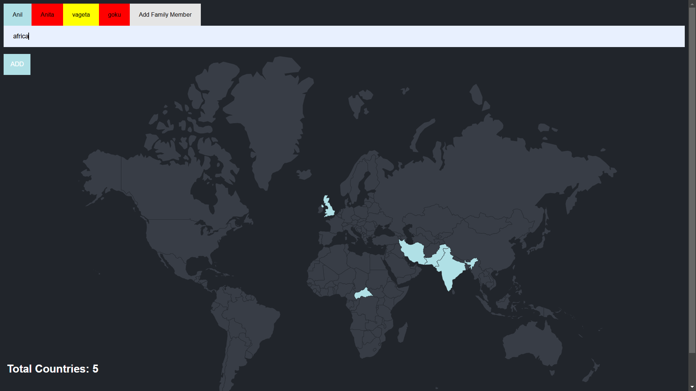

# 👨‍👩‍👧‍👦 Family Travel Tracker  

## 📌 Overview  
The **Family Travel Tracker** is a web application that allows multiple family members to track their visited countries on a **world map**. Each person can be selected, and their respective countries will be marked on the map.  

Built using **Node.js, Express, PostgreSQL.

## 🖼 Screenshot  
  

## 🚀 Features  
- 🏠 **Add Family Members**  
- 🌍 **Track Visited Countries for Each Person**  
- 📌 **Select a Person to View Their Travel History**  
- 💾 **Data Saved in PostgreSQL Database**  

## 🛠 Installation  

### **1️⃣ Clone the Repository**  
```bash
git clone <repo-url>
cd <repo-folder>
